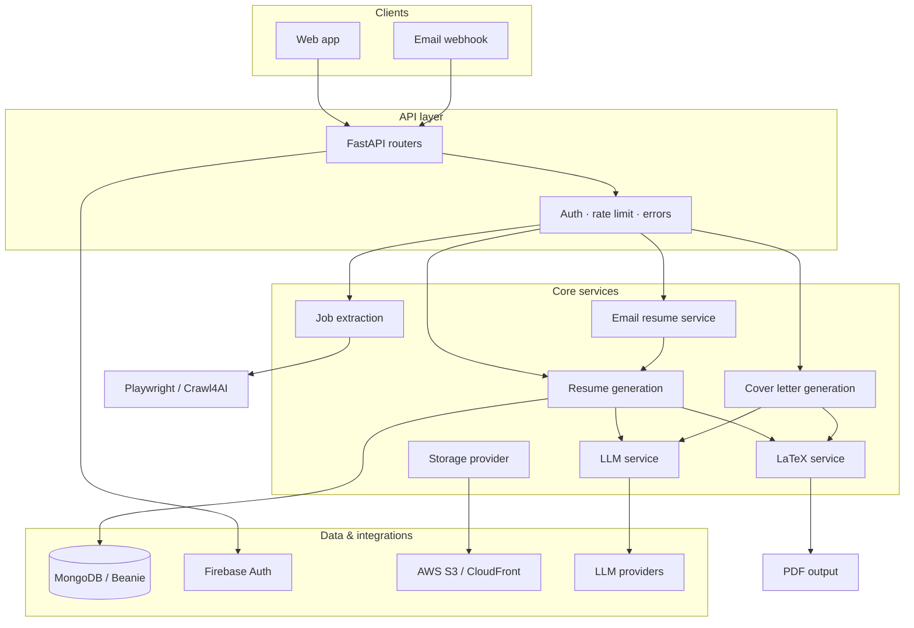

<div align="center">

# YARBA Backend

**Y**et **A**nother **R**esume **B**uilder **A**pp

*Portfolio-first resume generation — the LLM selects from your real experience, it never invents it.*

[](https://github.com/mucahitkayadan/yarba-backend/actions/workflows/ci.yml)
[](https://www.python.org/)
[](https://fastapi.tiangolo.com/)
[](https://beanie-odm.dev/)
[](tests/)
[](https://docs.astral.sh/ruff/)
[](https://mypy-lang.org/)
[](LICENSE)

<br/>


</div>

---

## The idea

Most AI resume builders read a job description and **hallucinate** skills and bullet points to match it. You end up with a resume that sounds perfect on paper but doesn't reflect what you actually did.

**YARBA takes a different path.**

You maintain a **portfolio** — your full career dataset: every role, project, skill, publication, and achievement, with multiple bullet points per job. When you apply, the LLM **selects and tailors** content from *your* data based on the job posting and *your* preferences. Nothing is fabricated; every line traces back to something you entered.

```
  Typical AI builder                    YARBA
  ──────────────────                    ─────
  Job posting  ──►  Invent skills       Portfolio (all your data)
                    & bullet points            │
                                               ▼
  Job posting  ──►  Generic output       LLM selects & ranks
                    that may be false          │
                                               ▼
                                         Tailored resume
                                         (truthful, preference-aware)
```

---

## What this demonstrates

| Capability | Implementation |
|------------|----------------|
| **Truthful AI** | LLM constrained to portfolio + profile data via structured prompts and JSON schema validation |
| **Layered architecture** | `api` routers → service layer → repositories → Beanie models, wired with FastAPI DI |
| **Multi-provider LLM** | [LiteLLM](https://github.com/BerriAI/litellm) abstraction — OpenAI, Anthropic, Gemini, user-level API keys |
| **LaTeX pipeline** | Section processors + compiler pattern → professional PDF resumes and cover letters |
| **Job-aware tailoring** | URL scraping (Playwright) + email-body parsing → job context fed into selection prompts |
| **Email automation** | Inbound webhooks → parse job from email → generate PDF → deliver via Resend |
| **Storage abstraction** | Local filesystem or S3 with CloudFront signed URLs; image/PDF validation |
| **Production hygiene** | GitHub Actions CI, Ruff, mypy, 133 pytest tests, pre-commit hooks, typed Pydantic v2 settings |

---

## Architecture



---

## Features

- **Portfolio management** — store complete career history with rich bullet points per role
- **Preference-aware selection** — LLM ranks and picks content aligned with your rules (e.g. clearance filters, tone, emphasis)
- **Job posting integration** — paste a URL or forward a job email; extract requirements automatically
- **LaTeX PDF output** — publication-quality resumes and cover letters, not HTML templates
- **Portfolio websites** — generate and deploy personal sites from portfolio data
- **Document parsing** — import existing resumes from PDF and DOCX
- **Multi-channel delivery** — API, email-to-resume workflow, cloud storage for assets

---

## Tech stack

| Layer | Technologies |
|-------|--------------|
| **Runtime** | Python 3.12, [uv](https://docs.astral.sh/uv/) |
| **API** | FastAPI, Uvicorn, Pydantic v2, python-multipart |
| **Database** | MongoDB, Beanie ODM, custom migration runner |
| **Auth** | Firebase Admin, PyJWT |
| **AI** | LiteLLM, structured JSON output, Jinja2 prompts |
| **Documents** | LaTeX, pdfminer-six, python-docx, Pillow |
| **Scraping** | Playwright, BeautifulSoup, Crawl4AI (optional fallback) |
| **Cloud** | boto3 (S3), CloudFront signing, AWS deployment service |
| **Email** | Resend, Svix webhook verification |
| **Quality** | pytest, pytest-asyncio, mongomock, Ruff, mypy, pre-commit, vulture |

---

## Project layout

```
api/          # Routes, schemas, middleware, dependencies
core/         # Models, services, repositories, LaTeX, job extraction
config/       # Typed settings (pydantic-settings)
utils/        # Storage, validation, file helpers
scripts/      # CLI utilities and migration runner
tests/        # API, service, and integration tests
templates/    # LaTeX and portfolio website themes
```

---

## Quick start

**Prerequisites:** Python 3.12, [uv](https://docs.astral.sh/uv/), MongoDB, LaTeX (for PDF generation).

```bash
uv python pin 3.12
uv sync
cp .env.example .env   # edit values — see .env.example for Firebase, LLM keys, storage
uv run uvicorn api.main:app --reload --reload-dir api --reload-dir config --reload-dir core --reload-dir utils
```

Open **http://127.0.0.1:8000/docs** for interactive API documentation.

---

## Development

| Task | Command |
|------|---------|
| Tests | `uv run pytest` |
| Lint | `uv run ruff check .` |
| Format | `uv run ruff format .` |
| Types | `uv run mypy` |
| Dead code | `uv run vulture` |
| Migrations | `uv run python scripts/run_migrations.py migrate` |
| Git hooks | `uv run pre-commit install` |

See [CONTRIBUTING.md](CONTRIBUTING.md) and [AGENTS.md](AGENTS.md).

---

## Deploy

**Docker (local):**

```bash
docker build -f Dockerfile.base -t yarba-base .
docker build --build-arg BASE_IMAGE=yarba-base -t yarba-backend .
```

**DigitalOcean App Platform** uses the slim root `Dockerfile` on top of `ghcr.io/mucahitkayadan/yarba-backend-base`. After changing `Dockerfile.base`, `pyproject.toml`, or `uv.lock`, GitHub Actions rebuilds the base image; routine app pushes only copy source (~1–2 min). First-time setup: run **Actions → Build base image → Run workflow**, make the GHCR package public (or add GHCR credentials in App Platform), then deploy.

---

## Documentation

- [Architecture](docs/ARCHITECTURE.md)
- [Database migrations](core/database/migrations/README.md)
- [LaTeX safety utilities](core/latex/utils/README.md)
- [Security policy](SECURITY.md)

---

## License

Source is available under the [Elastic License 2.0](LICENSE). You may use, modify, and self-host the software. You may **not** offer it as a hosted or managed service where users access a substantial portion of its features — see the license for full terms.

---

<div align="center">

Built by [Muja Kayadan](https://github.com/mucahitkayadan)

</div>
