# RBT Database Entity Relationship Diagram

```mermaid
erDiagram
    User ||--o{ Profile : "has"
    User ||--o{ Portfolio : "has"
    User ||--o{ Resume : "has"
    Profile ||--o{ Resume : "used in"
    Portfolio ||--o{ PortfolioItem : "contains"
    Portfolio ||--o{ Resume : "used in"
    Resume }o--|| Portfolio : "references"
    Resume }o--|| Profile : "references"
    Resume }o--|| Preamble : "uses"
    Resume }o--|| TexHeader : "uses many"
    
    User {
        ObjectId id PK
        string username
        string email
        string hashed_password
        boolean is_active
        boolean is_superuser
        boolean email_verified
        datetime last_login
        int login_attempts
        datetime account_locked_until
        string reset_password_token
        datetime reset_password_expires
        string verification_token
        string subscription_status
        datetime subscription_expires
        datetime last_active
        datetime created_at
        datetime updated_at
    }
    
    Profile {
        ObjectId id PK
        ObjectId user_id FK
        string full_name
        string email
        string phone
        string address
        string city
        string state
        string zip_code
        string country
        string linkedin
        string github
        string website
        binary signature
        string life_story
        object preferences "{ project_details, work_experience_details, skills_details, etc. }"
        datetime created_at
        datetime updated_at
    }
    
    Portfolio {
        ObjectId id PK
        ObjectId user_id FK
        ObjectId profile_id FK
        string title
        string description
        string professional_title
        object career_summary "{ job_titles[], years_of_experience, default_summary }"
        array skills "[ { category: string, skills: string[] } ]"
        array work_experience "[ { job_title, company, location, time, responsibilities[] } ]"
        array education "[ { degree_type, degree, university_name, time, location, GPA, transcript[] } ]"
        array projects "[ { name, bullet_points[], date } ]"
        array awards "[ { name, explanation } ]"
        array publications "[ { name, publisher, link, time } ]"
        array certifications "[]"
        object custom_sections "{ enabled: string[], order: string[] }"
        boolean is_active
        string version
        datetime created_at
        datetime updated_at
    }
    
    PortfolioItem {
        ObjectId id PK
        ObjectId portfolio_id FK
        string title
        string description
        string type
        string url
        array bullet_points "string[]"
        array tags "string[]"
        string date
        int order
        boolean is_featured
        string company
        string location
        datetime created_at
        datetime updated_at
    }
    
    Resume {
        ObjectId id PK
        ObjectId user_id FK
        ObjectId profile_id FK
        ObjectId portfolio_id FK
        string title
        int version
        string template_id
        string company_name
        string job_title
        string job_description
        object content "{ structured resume content }"
        array custom_sections "[ { title, content, order, is_visible } ]"
        binary resume_pdf
        string cover_letter_content
        binary cover_letter_pdf
        object llm_settings "{ model_type, model_name, temperature, p_value, etc. }"
        datetime created_at
        datetime updated_at
    }
    
    Preamble {
        ObjectId id PK
        string name
        string type
        string content
        boolean is_default
        datetime created_at
        datetime updated_at
    }
    
    TexHeader {
        ObjectId id PK
        string name
        string content
        string category
        boolean is_default
        datetime created_at
        datetime updated_at
    }
```



## Entity Descriptions

### User
The core user entity containing authentication and basic user information.
- Contains login credentials and account status information
- Stores subscription details and verification status

### Profile
Extended user information containing personal details and preferences.
- Contains personal contact information
- Stores user preferences for resume generation
- Includes signature image and life story for cover letters
- Linked to a user via user_id

### Portfolio
A collection of a user's professional information, work, projects, experiences, and skills.
- Contains professional information (skills, work experience, education, projects)
- Contains career summary with multiple job titles and experience
- Includes awards, publications, and certifications
- Stores custom sections with enabled sections and their order
- Linked to a user via user_id and optionally to a profile

### PortfolioItem
Individual showcase items within a portfolio, such as featured projects, case studies, etc.
- Simplified structure with essential fields only
- Contains bullet points instead of technologies/responsibilities
- Includes basic metadata like company, location, date
- Linked to a portfolio via portfolio_id

### Resume
A specific resume document created by a user.
- References a profile for personal information
- References a portfolio for professional information
- Contains job targeting information
- Stores generated PDF content
- Includes AI generation parameters as an object (llm_settings)
- Linked to a user via user_id

### Preamble
LaTeX preambles used for resume and cover letter generation.
- Contains LaTeX code for document setup
- Includes package imports, page settings, and custom commands
- Can be default or custom
- Used by resumes for PDF generation

### TexHeader
LaTeX headers used for custom LaTeX code generation.
- Contains LaTeX code for specific sections
- Organized by category (resume, cover_letter)
- Used as templates for generating different parts of a document
- Used by resumes for PDF generation

## Key Relationships

- A User can have multiple Profiles, Portfolios, and Resumes
- A Profile can be used in multiple Resumes
- A Portfolio contains professional information and multiple PortfolioItems
- A Portfolio can be used in multiple Resumes
- A Resume references one Profile (for personal info) and one Portfolio (for professional info)
- A Resume uses one Preamble and multiple TexHeaders for LaTeX generation

## Object Structures

### Profile.preferences
```json
{
  "project_details": {
    "max_projects": 4,
    "bullet_points_per_project": 3
  },
  "work_experience_details": {
    "max_jobs": 4,
    "bullet_points_per_job": 3
  },
  "skills_details": {
    "max_categories": 5,
    "min_skills_per_category": 3,
    "max_skills_per_category": 10
  },
  "career_summary_details": {
    "min_words": 15,
    "max_words": 25
  },
  "education_details": {
    "max_entries": 3,
    "max_courses": 4
  },
  "llm_preferences": {
    "model_type": "Claude",
    "model_name": "claude-3-5-sonnet-20240620",
    "temperature": 0.1
  }
}
```

### Portfolio.career_summary
```json
{
  "job_titles": [
    "Software Engineer",
    "Machine Learning Engineer",
    "Computer Vision Engineer",
    "Electrical Electronics Engineer",
    "Machine Vision Engineer"
  ],
  "years_of_experience": "3",
  "default_summary": "in software development, machine learning, and computer vision."
}
```

### Portfolio.skills
```json
[
  {
    "Category 1": [
      "Skill 1",
      "Skill 2", 
      "Skill 3"
    ]
  },
  {
    "Category 2": [
      "Skill 1",
      "Skill 2",
      "Skill 3" 
    ]
  }
]
```

### Resume.llm_settings
```json
{
  "model_type": "Claude",
  "model_name": "claude-3-5-sonnet-20240620",
  "temperature": 0.1,
  "p_value": 0.9,
  "max_tokens": 4000,
  "system_prompt_version": "v2.3"
}
``` 