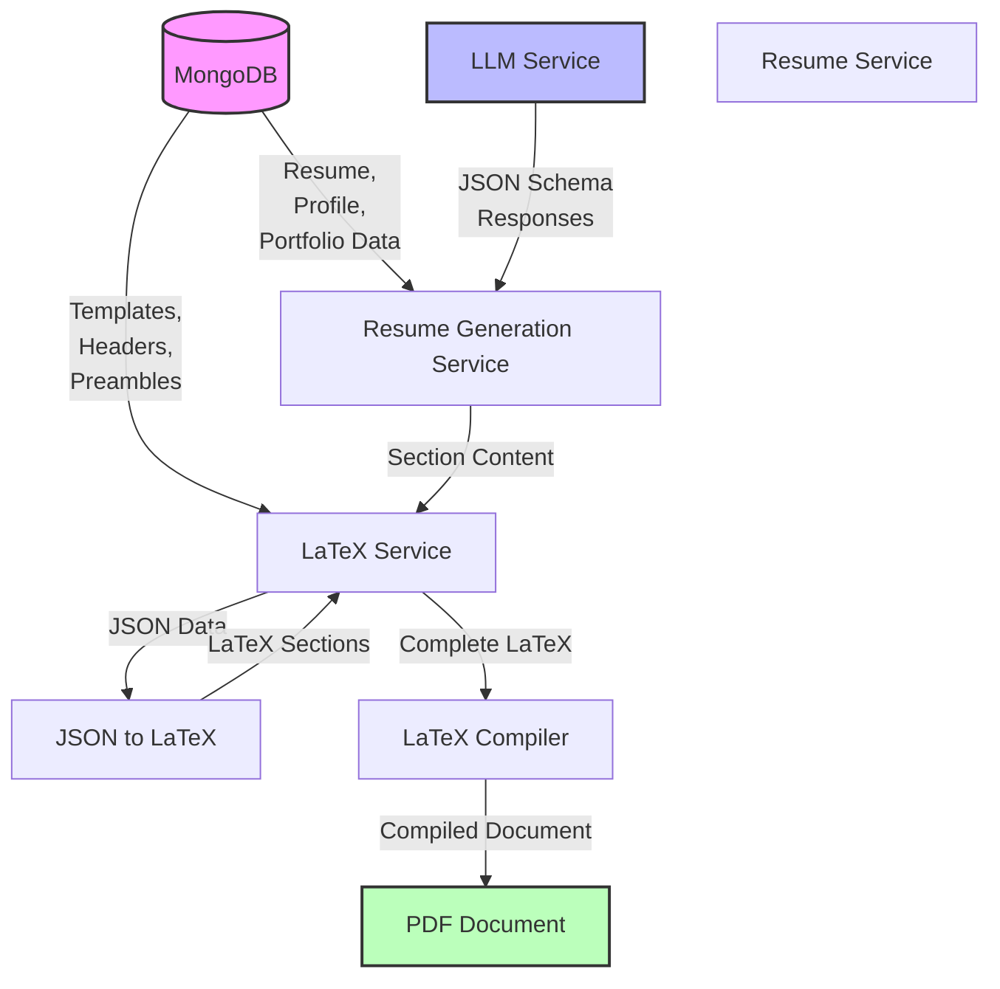
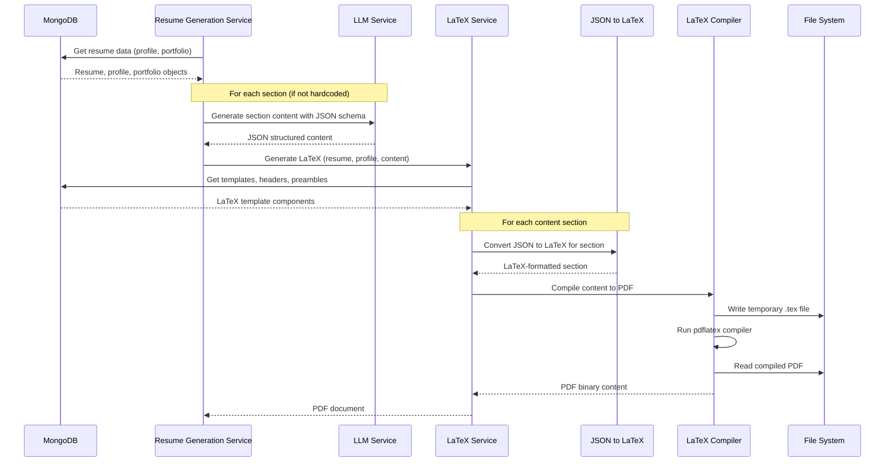
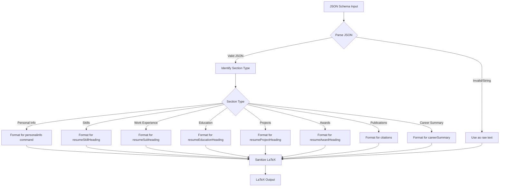
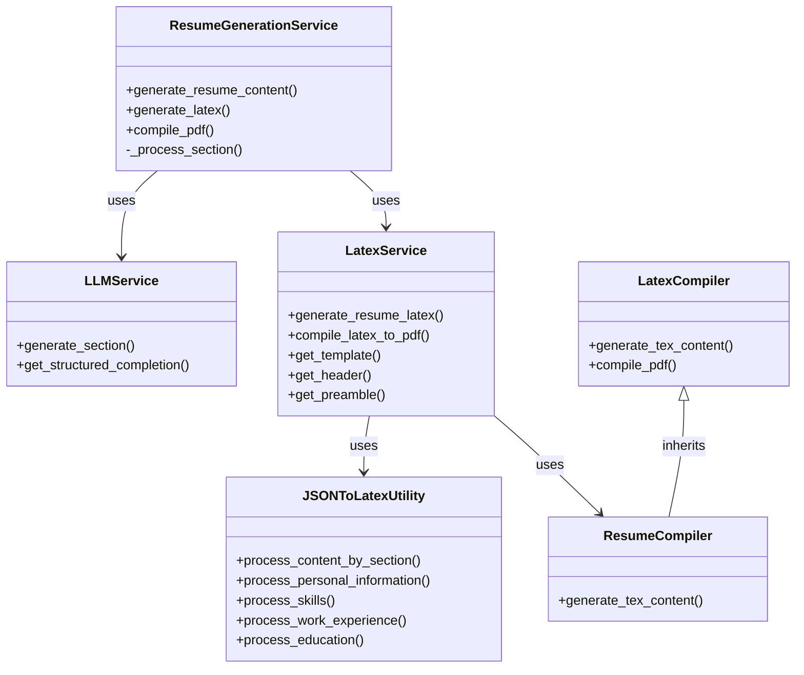
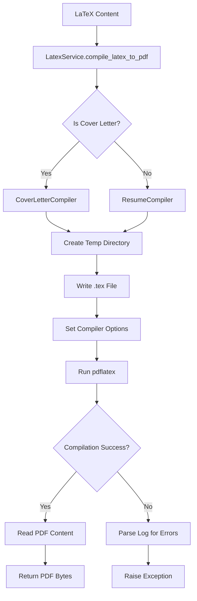
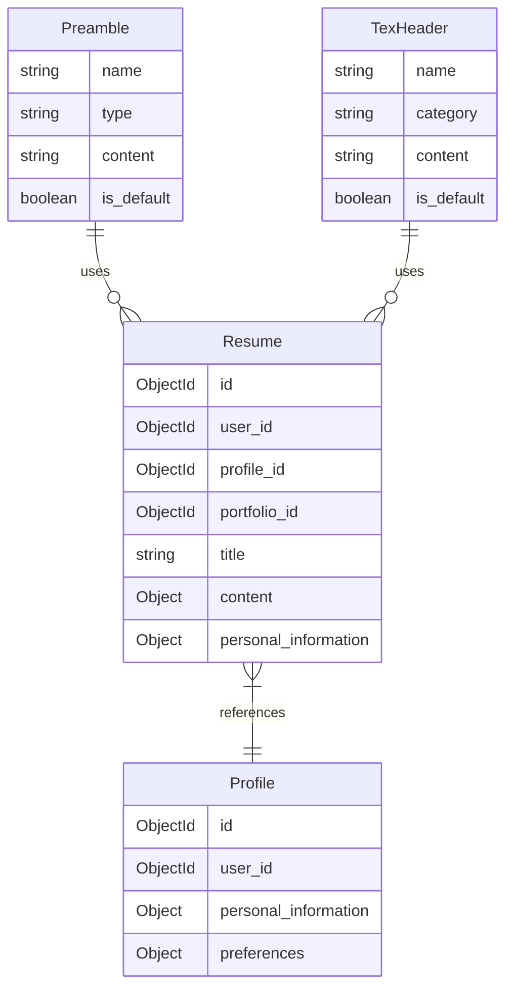
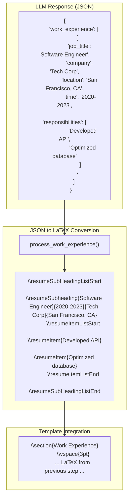
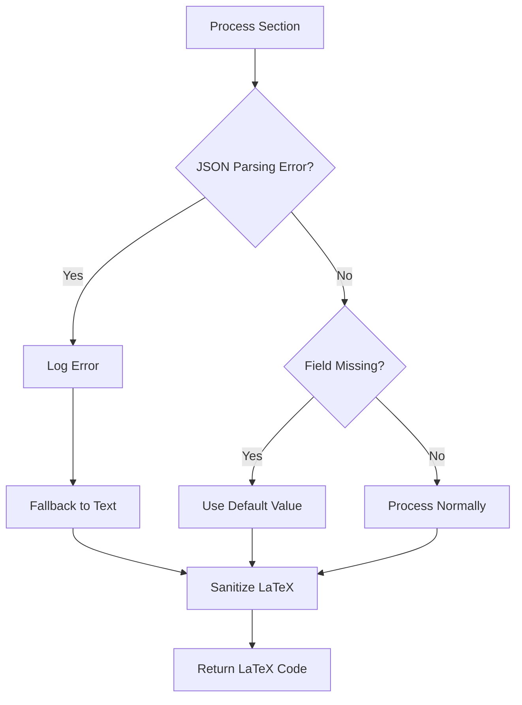

# LaTeX Generation Flow

This document outlines the flow of data through the LaTeX generation system, from database to PDF output. The system integrates with LLM-generated content structured as JSON and transforms it into LaTeX documents.

## System Architecture Overview

## Detailed Data Flow

## JSON Schema to LaTeX Conversion

## Components Interaction

## LaTeX Compilation Process

## Database Structure for LaTeX Templates

## Example Flow: From LLM Response to LaTeX

Here's an example showing how a work experience section flows through the system:

## Error Handling Flow

