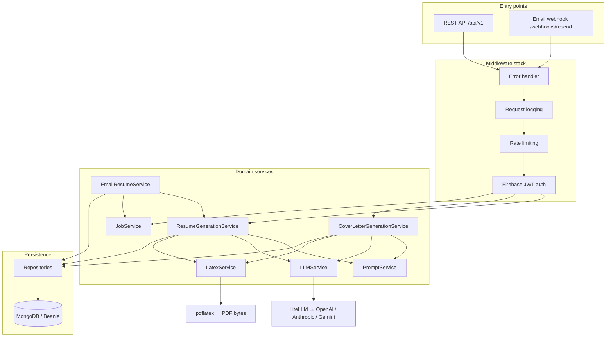
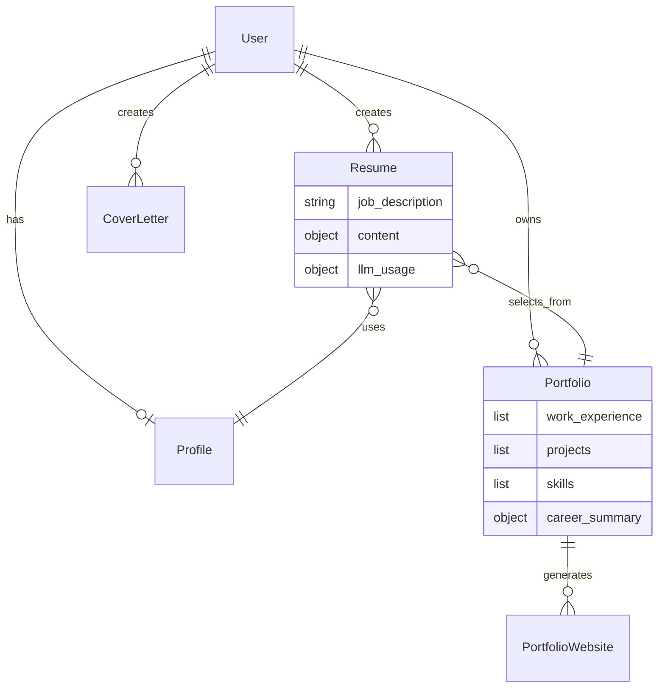
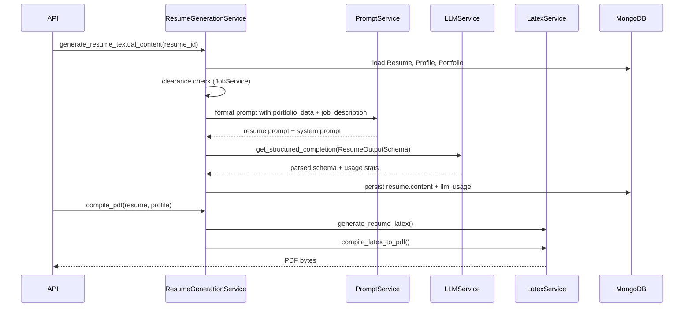
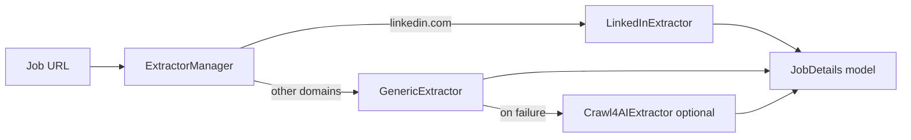
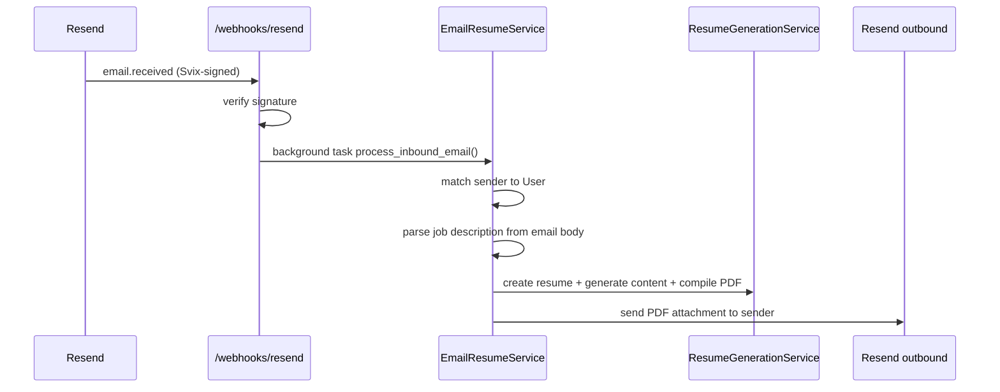

# Architecture

This document describes how the YARBA backend is structured, how data flows through the system, and the design decisions behind each major component.

For setup and development commands, see the [README](../README.md).

---

## Design principle: portfolio-first generation

Most AI resume tools treat the job description as the source of truth and generate content to match it — often inventing skills and bullet points the candidate never had.

YARBA inverts that model:

1. The user maintains a **portfolio** — the complete, authoritative record of their career (roles, projects, skills, publications, etc.), with multiple bullet points per job.
2. A **job description** provides context for tailoring (from a URL, pasted text, or parsed email).
3. The **LLM selects and ranks** content from the portfolio according to user **preferences** (tone, emphasis, clearance rules, per-provider API keys).
4. The result is stored as structured resume content, then rendered to **LaTeX → PDF**.

Every line in the output traces back to portfolio data. The model is constrained by prompts, portfolio injection, and a Pydantic output schema (`ResumeOutputSchema`).

---

## High-level overview



---

## Layered structure

| Layer | Location | Responsibility |
|-------|----------|----------------|
| **API** | `api/` | HTTP routes, request/response schemas, middleware, FastAPI dependencies |
| **Core** | `core/` | Domain models, business logic, repositories, LaTeX, job extraction |
| **Config** | `config/` | Typed settings (`pydantic-settings`), logging |
| **Utils** | `utils/` | Cross-cutting helpers (storage, validation, file I/O) |
| **Prompts** | `prompts/` | Jinja2 prompt templates loaded by `PromptLoader` |
| **Templates** | `templates/` | LaTeX document templates and portfolio website themes |
| **Scripts** | `scripts/` | CLI tools, one-off migrations, debugging utilities |

### Dependency direction

```
api/routers  →  api/dependencies  →  core/services  →  core/repositories  →  core/models
                     ↓
              config/settings
```

Routers stay thin: validate input, resolve dependencies, call a service, map the response. Business rules live in services, not in route handlers.

---

## Application bootstrap

`api/main.py` is the entry point.

1. **Environment** — loads `.env.local` (preferred) or `.env` via `python-dotenv`.
2. **Lifespan** — on startup:
   - `init_db()` connects to MongoDB and registers Beanie document models (`User`, `Resume`, `CoverLetter`, `Profile`, `Portfolio`, `PortfolioWebsite`, `InboundEmail`, `UnknownEmailSender`).
   - `FirebaseAuth.initialize()` sets up Firebase Admin for JWT verification.
3. **Middleware** — error handling, logging, rate limiting (see below).
4. **Routers** — mounted under `/api/v1` with OpenAPI tag metadata.

Static profile pictures are served from `/static/...` when `storage.provider` is `local`.

---

## Authentication

| Concern | Implementation |
|---------|----------------|
| Identity provider | Firebase Authentication |
| Token verification | `api/middleware/auth.py` — validates Firebase JWT on protected routes |
| User resolution | `AuthenticatedUser` model linked to MongoDB `User` document |
| Dependency injection | `CurrentUser` / `CurrentActiveUser` annotations in `api/dependencies/auth.py` |

Unauthenticated routes include health checks, OpenAPI docs, and inbound webhooks (verified separately via Svix).

---

## Middleware stack

Registered in `api/middleware/__init__.py` via `setup_middlewares()`:

| Order | Middleware | Purpose |
|-------|------------|---------|
| 1 | Error handler | Normalizes exceptions to consistent HTTP responses |
| 2 | Request logging | Structured request/response logging (bodies off by default) |
| 3 | Rate limiting | Global and per-route limits; PDF endpoints have stricter caps |

Excluded paths: `/docs`, `/redoc`, `/openapi.json`, `/`, `/api/v1/webhooks`.

---

## Domain model

### Core entities



**Portfolio** is the canonical career dataset. Each `WorkExperience` entry carries a `responsibilities` list (multiple bullet points). The LLM chooses which bullets to include — it does not author new ones from scratch.

**Resume** is a job-specific artifact: it references a portfolio and profile, stores the job description, holds LLM-generated structured content, and tracks per-generation LLM usage/cost.

**Profile** holds personal information, system preferences (clearance checks, feature flags), and per-user LLM provider settings.

---

## Resume generation pipeline

The central flow lives in `ResumeGenerationService` (`core/services/resume_generation_service.py`).



### Step-by-step

1. **Load context** — `get_resume_data()` fetches the `Resume`, linked `Profile`, and `Portfolio`.
2. **Clearance gate** — `JobService.check_job_restrictions()` blocks generation when the job requires clearance and the user has that preference enabled.
3. **Configure LLM** — `LLMService.configure_for_user()` applies per-user model, temperature, and API keys from profile preferences.
4. **Build prompt** — `PromptService` loads Jinja2 templates from `prompts/`, injects:
   - `portfolio_data` (full serialized portfolio)
   - `job_description`
   - user preference variables (tone, formatting rules, etc.)
5. **Structured LLM call** — `get_structured_completion()` returns a validated `ResumeOutputSchema` instance. LiteLLM handles provider routing; token usage and cost are recorded on the resume.
6. **Persist content** — structured output is saved to `resume.content`.
7. **LaTeX rendering** — `LatexService` delegates to `ResumeCompiler`, which uses section processors to map content fields to LaTeX.
8. **PDF compilation** — `pdflatex` runs in a temp directory; auxiliary files are cleaned up per settings.

Cover letter generation follows the same pattern via `CoverLetterGenerationService`, with its own schema and compiler.

---

## LaTeX subsystem

Located in `core/latex/`.

| Component | Role |
|-----------|------|
| `LatexCompiler` (base) | Abstract compiler: temp dirs, `pdflatex` invocation, cleanup |
| `ResumeCompiler` / cover letter compiler | Document-type-specific `generate_tex_content()` |
| `SectionProcessor` hierarchy | One processor per resume section (work experience, skills, education, …) |
| `SECTION_PROCESSORS` registry | Maps section names → processor classes |
| Safety utilities | `core/latex/utils/safety.py` — escapes user content before LaTeX insertion |

Adding a new resume section means: define the processor, register it in `SECTION_PROCESSORS`, extend the output schema and prompt template.

---

## LLM integration

`LLMService` (`core/services/llm_service.py`) wraps [LiteLLM](https://github.com/BerriAI/litellm).

| Feature | Detail |
|---------|--------|
| Multi-provider | OpenAI, Anthropic, Gemini (extensible via LiteLLM) |
| Per-user keys | Profile preferences override environment defaults |
| Structured output | `get_structured_completion()` with Pydantic schema validation |
| Cost tracking | Token counts and estimated cost stored per resume/cover letter |
| JSON repair | `json-repair` fallback when model output is malformed |

Prompts are **not** embedded in the service. `PromptService` + `PromptLoader` keep templates in `prompts/` as versionable, testable files.

---

## Job extraction

`core/job_extractor/` handles turning a job posting URL into structured text for resume tailoring.



- **LinkedInExtractor** — specialized scraper for LinkedIn job pages (Playwright).
- **GenericExtractor** — domain-specific CSS selectors with Playwright; optimized for common job boards.
- **Crawl4AIExtractor** — optional fallback when generic extraction fails.

Job text can also arrive via **email body parsing** (`core/utils/email_body_parser.py`) when users forward postings to the email-to-resume address.

---

## Email-to-resume flow

Enabled when `features.enable_email_to_resume` is true.



Webhook verification uses Svix headers (`core/utils/svix_verify.py`). Processing runs in a FastAPI `BackgroundTasks` handler so the webhook responds immediately.

---

## Storage

`utils/storage.py` defines a `StorageProvider` abstraction:

| Provider | Use case |
|----------|----------|
| **Local** | Development; files under configurable paths; served via FastAPI `StaticFiles` |
| **S3** | Production file storage (profile pictures, generated assets) |
| **CloudFront** | Signed URLs for time-limited private access |

All uploads pass validation (image type/size via Pillow, PDF magic-byte check) before persistence.

---

## Repository pattern

Repositories in `core/repositories/` wrap Beanie `Document` models:

- `BaseRepository[T]` — CRUD interface with `get_by_id`, `create`, `update`, `delete`, and query helpers.
- Concrete repos: `UserRepository`, `ProfileRepository`, `PortfolioRepository`, `ResumeRepository`, `CoverLetterRepository`, etc.

FastAPI dependencies in `core/database/factory.py` and `api/dependencies/services.py` wire repositories into services per request. An `AsyncMongoUnitOfWork` exists for transactional-style operations when needed.

---

## Settings

All configuration is centralized in `config/settings.py` using **Pydantic Settings v2**:

- Nested settings groups: `database`, `llm`, `latex`, `storage`, `api`, `resend`, `features`, …
- Environment variables mapped via `validation_alias` (not deprecated `env=` on `Field`)
- Secrets use `SecretStr` where appropriate
- Single `settings` singleton imported across the app

This keeps services testable: tests override env vars or inject mocks via FastAPI dependency overrides.

---

## Database migrations

Schema and data changes are managed outside Beanie's automatic indexing:

- Migration files: `core/database/migrations/YYYYMMDDHHMMSS_description.py`
- Runner: `scripts/run_migrations.py`
- Each migration implements `upgrade()` and `downgrade()`

See [migrations README](../core/database/migrations/README.md) for conventions.

Beanie handles ODM-level model registration at startup; migrations handle collection-level changes Beanie does not auto-apply.

---

## API surface

Routers mounted in `api/main.py`:

| Prefix | Router | Domain |
|--------|--------|--------|
| `/api/v1/auth` | `auth` | Registration, token exchange |
| `/api/v1/profiles` | `profiles` | User profile and preferences |
| `/api/v1/resumes` | `resumes` | Resume CRUD, generation, PDF |
| `/api/v1/cover-letters` | `cover-letters` | Cover letter CRUD, generation, PDF |
| `/api/v1/portfolios` | `portfolios` | Portfolio CRUD, parsing, import |
| `/api/v1` | `portfolio-websites` | Website generation and deployment |
| `/api/v1/jobs` | `job_router` | Job URL extraction |
| `/api/v1/webhooks` | `webhooks` | Inbound email (Resend) |

OpenAPI documentation is auto-generated at `/docs` and `/redoc`.

---

## Testing strategy

| Layer | Location | Approach |
|-------|----------|----------|
| API | `tests/api/` | Route and schema tests with dependency overrides |
| Services | `tests/core/` | Service logic, parsers, repositories |
| LLM format | `tests/test_resume_llm_format.py` | Schema validation without live API calls |
| Fixtures | `tests/conftest.py` | Shared mocks, mongomock for async MongoDB |

CI (`.github/workflows/ci.yml`) runs Ruff, mypy, and pytest on every push and pull request. **187 tests** as of the last collection run.

---

## Deployment

### Docker

Two-stage build:

1. **`Dockerfile.base`** — Python 3.12, uv, system deps (LaTeX, Playwright browsers). Published to `ghcr.io/mujakayadan/yarba-backend-base`.
2. **`Dockerfile`** — Slim image; copies application source on top of the base. Rebuilds in ~1–2 minutes for code-only changes.

GitHub Actions workflow `build-base-image.yml` rebuilds the base when `Dockerfile.base`, `pyproject.toml`, or `uv.lock` change.

### DigitalOcean App Platform

Production deploys use the slim `Dockerfile` with the pre-built GHCR base image.

---

## Key design decisions

| Decision | Rationale |
|----------|-----------|
| Portfolio as source of truth | Prevents LLM hallucination; output is auditable against user data |
| Structured LLM output (Pydantic schema) | Type-safe content pipeline; LaTeX processors consume known shapes |
| LiteLLM abstraction | Swap providers without rewriting service code; per-user API keys |
| LaTeX over HTML templates | Professional typography; user-controlled templates |
| Repository + service layers | Testable business logic; routers stay thin |
| Typed settings singleton | One config source; env-driven without magic strings |
| Background email processing | Webhook ACK is fast; generation can take 30s+ |
| Rate limits on PDF endpoints | LaTeX compilation is CPU-heavy; protects against abuse |
| Elastic License 2.0 | Source-open for learning and self-hosting; restricts commercial SaaS re-hosting |

---

## Related documentation

- [README](../README.md) — overview, quick start, badges
- [CONTRIBUTING.md](../CONTRIBUTING.md) — contributor setup
- [SECURITY.md](../SECURITY.md) — vulnerability reporting
- [Database migrations](../core/database/migrations/README.md)
- [LaTeX safety utilities](../core/latex/utils/README.md)
- [AGENTS.md](../AGENTS.md) — conventions for AI-assisted development
